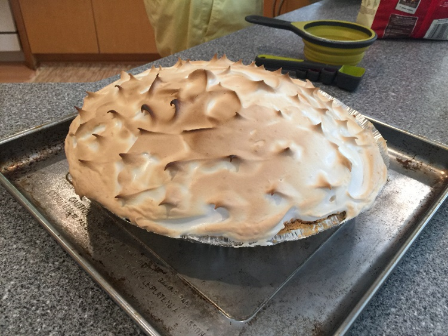

# 10과- 나의 취미

취미가 너무 많은 것 같아서 그 중 세 가지만 이야기하겠다. 내 가장 오래된 취미는 요리와 베이킹이다. 나는 6살 때부터 요리를 해왔는데, 그때 어머니를 도와 부엌에서 요리를 했다. 중학교와 고등학교 때 가족들을 위해 저녁을 자주 요리하기 시작하고, 가끔 빵도 굽기도 했다. 레스토랑에 가는 것보다 저렴하고 건강하기 때문에 버클리에서 거의 모든 식사를 직접 요리한다. 요리는 원하는 것은 무엇이든 만들 수 있기 때문에 재미있고, 친구들과 함께 하는 것도 재미있다. 내 또 다른 취미는 컴퓨터 게임이다. 나는 컴퓨터를 사기 위해 첫 직장에서 돈을 번 후 15살 때 시작했다. 나는 새롭고 다양한 이야기를 배우기 때문에 게임이 재미있다. 나는 또한 같은 장소에 살지 않더라도 친구들과 게임을 할 수 있기 때문에 게임을 좋아한다. 스트레스를 푸는 좋은 방법이다. 나는 거의 매일 게임을 한다. 내 마지막 취미는 물건을 만들고 고치는 것이다. 나는 어렸을 때 레고 세트를 가지고 물건을 만들기 시작했지만 지금은 여러 다양한 물건울 만들고 고친다. 나는 컴퓨터와 키보드를 만든 적이 있는데, 지금도 사용하고 있는다. 나는 자동차 수리도 좋아하는데, 때로는 너무 힘들어서 죽겠다. 고친 후에 작동하는 것을 보니 매우 멋있더라고. 보통 물건을 만드는 데 꽤 비싸기 때문에 일 년에 한두 번만 이것을 할 수 있다. 

    
    

    

