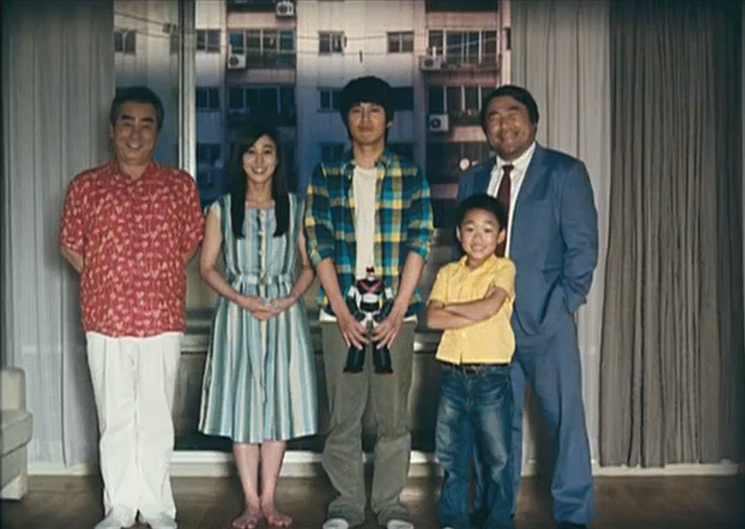

# 헬로우 고스트 영화 감상문
강상만이라는 이름의 한 남자는 매우 외롭고 자살을 시도했다. 그리고 나서 그는 유령을 보기 시작하지만, 아무도 그들을 볼 수 없었다. 의사들은 그가 미쳤다고 생각했다. 점쟁이는 상만이 잠시 죽었기 때문에 그들과 함께 있다고 말했다. 각각의 유령들을 위해, 상만은 그들이 떠날 수 있도록 그들을 위한 소원을 성취해야 했다. 그러나, 상만이 소원을 이룰 때, 상만은 유령들과 친구가 됐다. 상만은 가족을 갖는 것이 어떤 것인지 이해하기 시작했다. 상만은 또한 병원에서 온 간호사와 사랑에 빠졌다. 상만은 간호사의 아버지가 죽은 후 간호사가 간호사의 아버지와 연결되도록 도왔다. 그러나 그 후 그 유령들은 떠나려고 했다. 그러나 상만은 다시 자살을 시도했다. 그러나 그 간호사에 대한 상만의 사랑은 상만이 살고 싶게 만들었다. 그리고 나서 상만은 그 유령들이 내내 상만의 가족이었다는 것을 발견했다. 그들은 자동차 사고로 죽었지만, 상만은 그들과의 기억을 모두 잊었다. 유령들은 돌아와서 작별을 고하고, 그리고 나서 상만은 간호사 연수와 결혼했다. 그들은 아이가 있고 행복했다. 

이 이야기는 나에게 많은 감정을 느끼게 했다. 때로는 웃기기도 하거나 때로는 눈물이 날 뻔하기도 했다. 그것은 한 사람의 삶에서 가족의 중요성에 대한 아름다운 이야기이다. 유령들은 상만이 상만의 주변 사람들이 삶을 위대하게 만드는 것이라는 것을 깨닫게 도와준다. 만약 내가 상만이라면 나도 행복했을 것이다. 나는 이 영화의 의미가 정말 마음에 들어 친구들과 가족들에게 추천하고 싶다. 나는 10점 만점에 8.5점을 주었다.

    <figure>
    
    <figcaption>상만과 상만의 가족들</figcaption>
    </figure>

## 초고
### 요약:
강상만이라는 이름의 한 남자는 매우 외롭고 자살을 시도했다. 그리고 나서 그는
유령을 보기 시작하지만, 아무도 그들을 볼 수 없었다. 의사들은 그가 미쳤다고 생각했다.
점쟁이는 상만이 잠시 죽었기 때문에 그들과 함께 있다고 말했다. 각각의 유령들을 위해,
상만은 그들이 떠날 수 있도록 그들을 위한 소원을 성취해야 했다. 그러나, 상만이 소원을
이룰 때, 상만은 유령들과 친구가 됐다. 상만은 가족을 갖는 것이 어떤 것인지 이해하기
시작했다. 상만은 또한 병원에서 온 간호사와 사랑에 빠졌다. 상만은 간호사의 아버지가
죽은 후 간호사가 간호사의 아버지와 연결되도록 도왔다. 그러나 그 후 그 유령들은
떠나려고 했다. 그러나 상만은 다시 자살을 시도했다. 그러나 그 간호사에 대한 상만의
사랑은 상만이 살고 싶게 만들었다. 그리고 나서 상만은 그 유령들이 내내 상만의
가족이었다는 것을 발견했다. 그들은 자동차 사고로 죽었지만, 상만은 그들과의 기억을
모두 잊었다. 유령들은 돌아와서 작별을 고하고, 그리고 나서 상만은 간호사 연수와
결혼했다. 그들은 아이가 있고 행복했다.

### 내 생각:
이 이야기는 나에게 많은 감정을 느끼게 했다. 때로는 웃기기도 하거나 때로는
눈물이 날 뻔하기도 했다. 그것은 한 사람의 삶에서 가족의 중요성에 대한 아름다운
이야기이다. 유령들은 상만이 상만의 주변 사람들이 삶을 위대하게 만드는 것이라는 것을
깨닫게 도와준다. 만약 내가 상만이라면 나도 행복했을 것이다. 나는 이 영화의 의미가
정말 마음에 들어 친구들과 가족들에게 추천하고 싶다. 나는 10 점 만점에 8.5 점을 주었다.