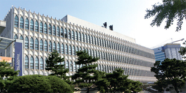

# 제 아픈 경험

내가 한국에 있을 때 여러 번 아팠다. 미국에서는 평소에 아프지 않아서 이렇게 많이 아플 줄은 몰랐다. 한국에서는 미국과는 다른 세균을 가지고 있어서 아팠던 것 같다. 두 번째 아팠을 때가 가장 심했다. 언어 교환 프로을 위해 뒤풀이에 갔을 때 감기에 걸렸던 것 같다. 그곳에서 마스크를 착용할 걸 그랬다. 내가 기침하고, 인후통하고, 몸살하고, 코막힘이 매우 심했다. 쉬면서 나아지려고 노력했지만, 사흘 후에 의사에게 갔다. 연세병원에 가려다가, 그때 매우 바쁜 것을 보고 대신 학교 진료소에 갔다. 그곳의 의사는 영어를 조금밖에 하지 않아서, 나는 내 증상을 한국어로 말했다. 의사는 통증과 코막힘에 도움이 되는 처방전을 주셨다. 나에게 식후에 복용할 수 있는 사흘 약을 주셨다. 나는 많이 쉬었고, 운동을 하지 않았으며, 약을 먹었다. 나는 또한 아플 때 한국에서 먹고 마시기에 인기 있는 죽, 유자 인삼 차, 비타 500을 먹었다. 마침내, 4일 후에 건강이 나아졌고, 다시 운동을 하고 장소를 갈 수 있었다. 일주일 후에 나아 버렸다. 미국에 돌아온 후, 나는 다행히 감기에 걸리지 또 않았다.

    <figure>
    
    <figcaption>연세대학교 보건진료소는 학생회관에 있다</figcaption>
    </figure>

## 초고
내가 한국에 있을 때 여러 번 아팠다. 미국에서는 평소에 아프지 않아서 이렇게 많이 아플 줄은 몰랐다. 한국에서는 미국과는 다른 세균을 가지고 있어서 아팠던 것 같다. 두 번째 아팠을 때가 가장 심했다. 언어 교환 프로을 위해 뒤풀이에 갔을 때 감기에 **걸리**던 것 같다. 그곳에서 마스크를 착용할 걸 그랬다. **내** 기침하고, 인후통하고, 몸살하고, 코막힘이 매우 심했다. 쉬면서 나아지려고 노력했지만, 사흘 후에 의사에게 갔다. 연세병원에 가려다가, 그때 매우 바쁜 것을 보고 대신 학교 진료소에 갔다. 그곳의 의사는 영어를 조금밖에 하지 않아서, 나는 내 증상을 한국어로 말했다. 의사는 통증과 코막힘에 도움이 되는 처방전을 주셨다. 나에게 식후에 복용할 수 있는 사흘 약을 주셨다. 나는 많이 쉬었고, 운동을 하지 않았으며, 약을 먹었다. 나는 또한 아플 때 한국에서 먹고 마시기에 인기 있는 죽, 유자 인삼 차, 비타 500을 먹었다. 마침내, 4일 후에 건강이 나아졌고, 다시 운동을 하고 장소를 갈 수 있었다. 일주일 후에 **낫아** 버렸다. 미국에 돌아온 후, 나는 다행히 감기에 걸리지 또 않았다.