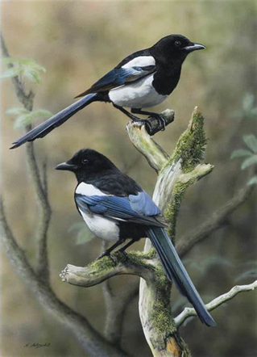
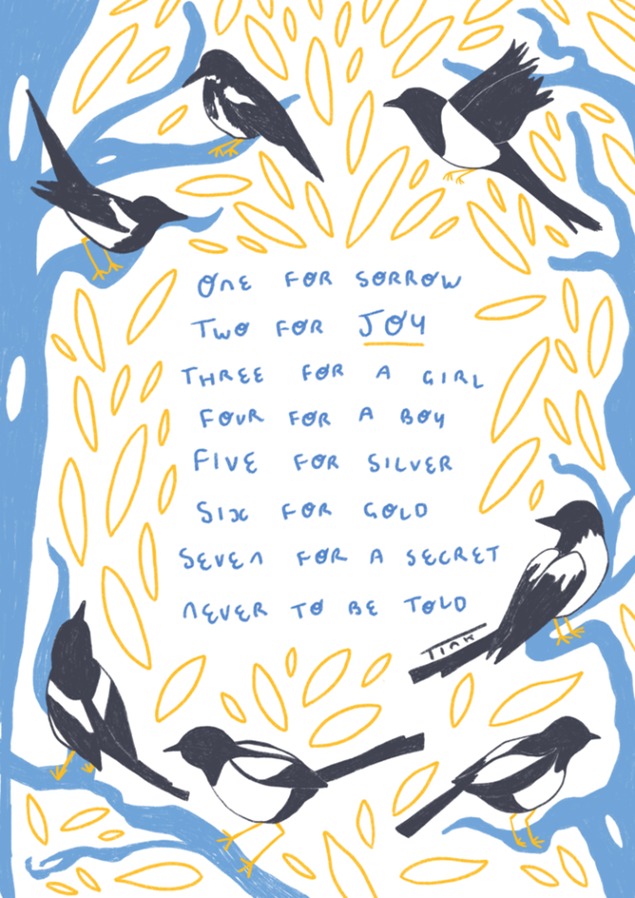

# 세계 미신

영국에서 가장 인기 있는 미신 중 하나는 까치와 관련이 있습니다. 까치가 영국에서 매우 흔한도 불구하고, 만약 여러분이 하나를 혼자 본다면, 영국 사람들은 불운이 오고 있다고 믿습니다. 하지만, 여러분이 더 많은 까치를 함께 볼수록, 영국 사람들은 더 많은 일들이 일어날 것이라고 믿습니다. 만약 여러분이 두 마리를 본다면, 여러분은 행운을 가질 것입니다. 여러분이 서너 마리를 본다면, 여러분은 여자 아이나 남자 아이를 가질 것이고, 5마리 또는 6마리를 본다면, 여러분은 은 또는 금을 얻을 것입니다. 마지막으로, 만약 여러분이 일곱 마리를 본다면, 여러분은 영원히 젊음을 유지하는 비밀을 배울 것입니다. 영국의 모든 사람들은 동요 때문에 이것을 알고 있습니다:

One for sorrow

Two for joy

Three for a girl

Four for a boy

Five for silver

Six for gold

Seven for a secret never to be told

이 운율은 1700년대에 시작되었고 오늘날에도 여전히 어린이들이 부릅니다. 아무도 누가 이 운율을 만들었는지, 왜 사람들이 까치에 대한 미신을 가지고 있는지 알지 못합니다. 어떤 사람들은 까치가 마녀의 새이기 때문이라고 생각합니다. 반면에, 사람들은 까치의 사촌격인 레이븐스는 영국을 보호한다고 생각합니다. 이러한 미신이 영국에서 왔는데도 미신은 저에게 까치에 대한 한국의 미신을 생각나게 합니다. 한국에서 까치는 행운입니다. 제가 한국에 있을 때 저는 매일 많은 까치를 보곤 했습니다. 비록 저는 이 미신을 믿지 않지만, 까치는 매우 똑똑하고 재미있는 새라고 생각합니다.

    <figure>
    
    <figcaption>까치</figcaption>
    </figure>

    <figure>
    
    <figcaption>영국의 까치시</figcaption>
    </figure>

## 초고

영국에서 가장 인기 있는 미신 중 하나는 까치와 관련이 있습니다. 까치가 영국에서 매우 흔**하는**데도 불구하고, 만약 여러분이 하나를 혼자 본다면, 영국 사람들은 불운이 오고 있다고 믿습니다. 하지만, 여러분이 더 많은 까치를 함께 볼수록, 영국 사람들은 더 많은 일들이 일어날 것이라고 믿습니다. 만약 여러분이 두 마리를 본다면, 여러분은 행운을 가질 것입니다. 여러분이 서너 마리를 본다면, 여러분은 여자 아이나 남자 아이를 가질 것이고, 5마리 또는 6마리를 본다면, 여러분은 은 또는 금을 얻을 것입니다. 마지막으로, 만약 여러분이 일곱 마리를 본다면, 여러분은 영원히 젊음을 유지하는 비밀을 배울 것입니다. 영국의 모든 사람들은 동요 때문에 이것을 알고 있습니다:

One for sorrow

Two for joy

Three for a girl

Four for a boy

Five for silver

Six for gold

Seven for a secret never to be told

이 운율은 1700년대에 시작되었고 오늘날에도 여전히 어린이들이 부릅니다. 아무도 누가 이 운율을 만들었는지, 왜 사람들이 까치에 대한 미신을 가지고 있는지 알지 못합니다. 어떤 사람들은 **그들**이 마녀의 새이기 때문이라고 생각합니다. 반면에, 사람들은 까치의 사촌격인 레이븐스는 영국을 보호한다고 생각합니다. 이러한 미신이 영국에서 왔는데도 미신은 저에게 까치에 대한 한국의 미신을 생각나게 합니다. 한국에서 까치는 행운입니다. 제가 한국에 있을 때 저는 매일 많은 까치를 보곤 했습니다. 비록 저는 이 미신을 믿지 않지만, 까치는 매우 똑똑하고 재미있는 새라고 생각합니다.
