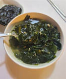

# 한국의 생일 문화

한국에서 생활한 후, 나는 한국과 미국의 생일 문화에 많은 차이가 있는 것을 봤다. 처음에는 인터넷에서 본 것 때문에 두 나라에서 똑같다고 생각했다. 그런데 나와 같은 해에 태어난 몇몇 학생들이 2살 연상이라고 하자 나는 바로 혼란에 빠졌다. 첫 번째 차이점은 한국 나이가 국제 나이와 다르게 측정된다는 것이다. 한국에서 나이는 1월 1일에 1살씩 늘고 태어나면 모두 한 살이 된다. 미국에서 나이는 생일에 항상 는다. 중요한 생일도 다르다. 한국에서 가장 중요한 생일은 1살, 60살, 70살이고 그 이름은 돌잔치, 환갑, 고희다. 미국에서 가장 중요한 생일은 16살, 18살, 21살이다.  16살에는 운전을 해도 되고, 18살에는 투표를 해도 되고, 21살에는 술을 마실 수 있게 되기 때문이다. 한국에서는 생일에 미역국을 먹는 것이 전통인데 미국에서 전통 음식이 없다. 미국에서 자주 피자를 먹고 두 나라에서 케이크를 먹는다. 미국의 생일파티는 보통 식당이나 다른 공공장소에서 한다. 반면, 한국의 생일파티는 대부분 집에서 한다. 미국에서 생일 카드는 흔한 선물이다. 한국에서는 보통 카드를 주지만 사람들은 다른 선물을 준다. 많은 차이가 있지만 생일 축하는 여전히 매우 비슷하다고 생각한다. 

    <figure>
    
    <figcaption>미역국</figcaption>
    </figure>

    <figure>
    
    <figcaption>피자</figcaption>
    </figure>

## 초고
한국에서 생활한 후, **저**는 한국과 미국의 생일 문화에 많은 차이가 있는 것을 봤다. 처음에는 인터넷에서 본 것 때문에 두 나라에서 똑같다고 생각했다. 그런데 **저**와 같은 해에 태어난 몇몇 학생들이 2 살 연상이라고 하자 **저**는 바로 혼란에 빠졌**습니다**. 첫 번째 차이점은 한국 나이가 국제 나이와 다르게 측정된다는 것이다. 한국에서 나이는 1 월 1 일에 1 살씩 늘고 태어나면 모두**는** 한 살이 **되**다. 미국에서 나이는 생일에 항상 는다. 중요한 생일도 다르다. 한국에서 가장 중요한 생일은 1 살, 60 살, 70 살이고 그 이름은 돌잔치, 환갑, 고희다. 미국에서 가장 중요한 생일은 16 살, 18 살, 21 살이다. 16 살에는 운전을 **하**도 되고, 18 살에는 투표를 **하**도 되고, 21 살에는 술을 **마 수시도** 되기 때문이다. 한국에서는 생일에 미역국을 먹는 것이 전통인데 미국에서 전통 음식이 없**는**다. 미국에서 자주 피자를 먹고 두 나라에서 케이크를 먹는다. 미국의 생일파티는 보통 식당이나 다른 공공장소에서 **있는**다. 반면, 한국의 생일파티는 대부분 집에서 **있는**다. 미국에서 생일 카드는 흔한 선물이다. 한국에서는 보통 카드를 주지만 사람들은 다른 선물을 준다. 많은 차이가 있지만 생일 축하는 여전히 매우 비슷하다고 생각한다.
