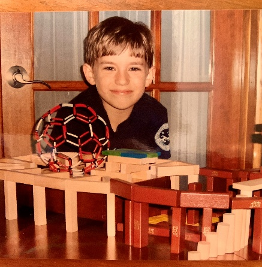
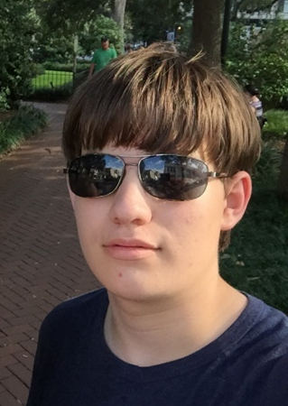
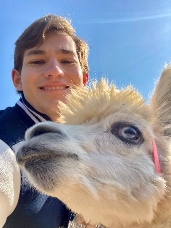

# 나의 머리 변천사

내 머리는 원래 매우 두껍기 때문에 자르기가 매우 어렵게 된다. 어렸을 때 여러 이발소를 다녔지만, 모두 머리를 잘 자르지 못했다. 이 때문에, 나는 항상 같은 머리를 했다. 아기였을 때, 나는 금발이었지만, 나이가 들면서 머리가 어두워졌다. 중학교하고 고등학교 때, 지금처럼 머리가 갈색으로 변했다. 그 이후로, 머리는 크게 변하지 않은 거다. 이발소에 가는 것을 싫어해서, 일 년에 3번만 머리를 자르곤 했다. 나는 항상 앞머리가 길고 옆머리가 짧았다. 나는 매우 나빠 보였던 것 같다. 대학교 초에는 아직 코로나 때였다. 내가 집에서 사는 동안, 우리 어머니께서 내 머리를 자르셨다. 하지만 혼자 살았을 때, 나는 한번도 머리를 자르지 않았고, 이렇게 아주 길고 굵어졌다. 마침내 머리를 자르고 머리가 훨씬 가벼워졌다. 지금은 같은 스타일로 두 달에 한 번씩 머리를 자르고 있는데, 아주 자연스러운 모습이다. 머리를 스타일링하기 위해 아침에만 빗질을 한다. 나는 미래에 머리 스타일을 바꿀지도 모른다. 나는 머리를 기른다고 생각하고 한동안 긴 머리를 할 생각을 자주 하는데, 어떻게 보일지는 잘 모르겠다. 하지만, 나는 짧은 머리 스타일이 좋아서 보통 자를 것이다.

    
    
    

