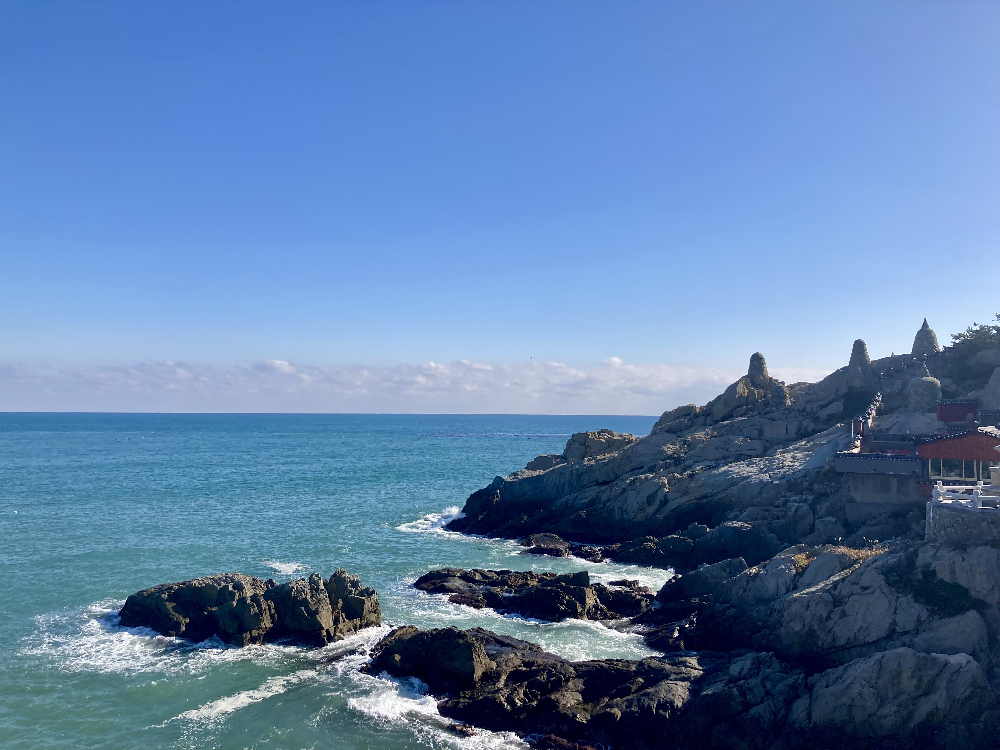

    <figure>
    
    </figure>
        <figure>
    
    </figure>

# 동급생 면접

## 1. 앞으로 한국어로 뭐 하면 좋겠어요? 

### 다이애나: 앞으로 한국으로 비티에스의 콘서트에 정말 가고 싶어요. 

### 도빈: 아마도 한국 친구들이랑 한국어로 편하게 얘기할 수 있으면 좋겠어요. 그리고, 미래에 가족들이랑 한국어로 말하고 싶어요.

### 리온: 한국 요리를 배우면 좋겠어요. 

### 리즈: 앞으로 한국에 가고 몇년 동안 일하고 싶어요. 그때는 한국어를 할 수 있는지 아주 중요할 것이예요.

### 비키: 한국에서 유학을 하고 드라마를 봐요. 

### 사바나: 쇼핑 하고 한국 음식을 먹고 싶어요. 

### 신디: 아직 몰라요. 

### 심연: 앞으로 한국에서 엔터테인먼트 회사에서 예능 프로를 제작했으면 좋겠어요.

### 알렉스: 많은 친구 만나요. 

### 에이미: 앞으로 한국에 갈 수 있으면 한국말로 음식을 많이 주문하면 좋겠어요.

### 클로이: 좋은 이야기를 만드고 싶어요. 

## 2. 다시 1학년 학생이라면 뭐 다른게 하고 싶어요?

### 다이애나: 다시 1학년 학생이라면 저는 더 많은 사람들을 만나고 싶었을 것 같아요.

### 도빈: 저는 지금 1학년인데, 다시 1학년 생활을 경험 할 수 있으면 아마도 더 여러가지의 동아리를 해보고 싶어요.

### 리온: 더 많은 친구를 사귀고 싶어요

### 리즈: 친구랑 더 자주 놀러 가고 미래 위해 더 준비해요.

### 비키: 친구들과 더 많이 사귀고 싶어요

### 사바나: 다시 1학년 학생이라면 저는 친구들이 많이 사귀고 싶어요. 

### 신디: 많이 수업을 안 들어요. 

### 심연: 아마 수학 수업과 컴퓨터 과학 수업을 더 일찍 들었으면 해요.

### 알렉스: 동아리를 더 해요. 

### 에이미: 제가 다시 1학년 학생이라면 더 공부하고 동아리에 가입하고 컴퓨터 과학 전공을 정하고 일찍 취직을 시작하고 부전공도 하고 친구를 사귀고 싶어요. 그랬다면 졸업할 때 후회는 없었을 것 같아요.

### 클로이: 사람은 더 만났으면 좋겠어요. 
