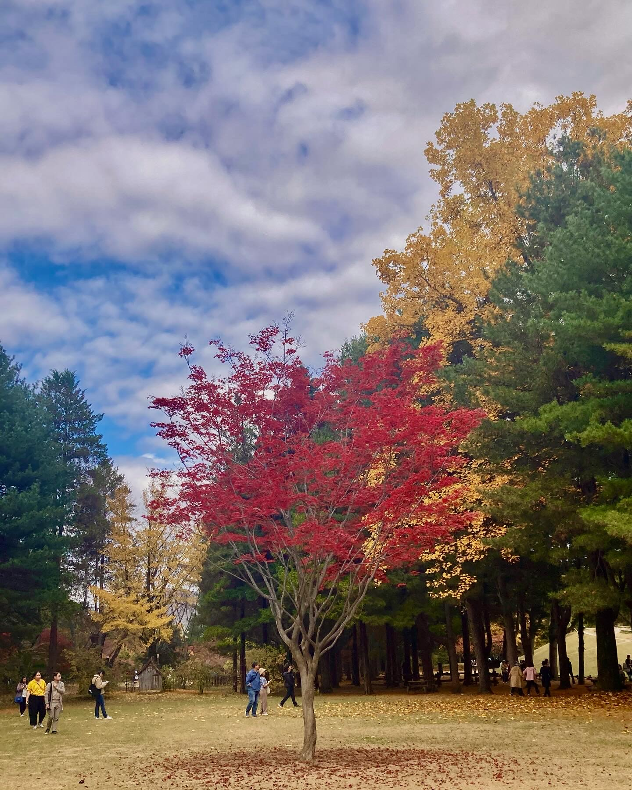
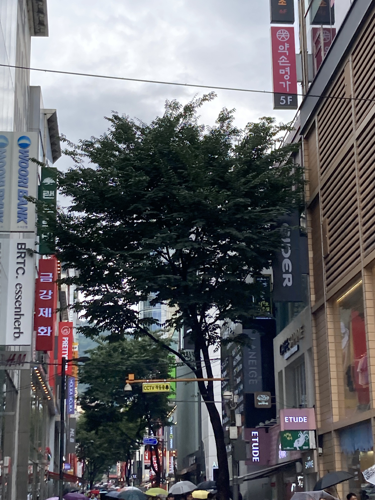

    <figure>
    
    </figure>
        <figure>
    
    </figure>

# 내가 나무라면

내가 나무라면   

그대 그늘을 주기 위해 성장하고 싶어   

시원한 여름 바람 함께   

나 그대 낮잠 자는 것을 돕고 싶어   

내가 꿀벌이라면   

그대 꿀을 만들고 싶어   

나무에서 그대 훨씬 위에   

나 그대 행복하게 보고 싶어

