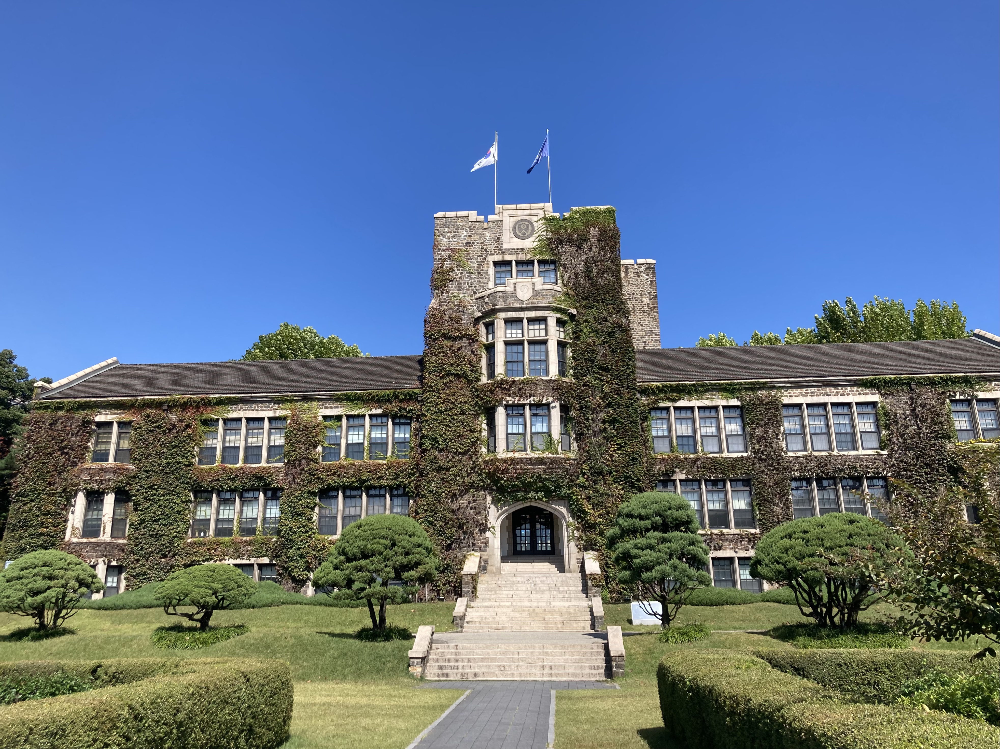
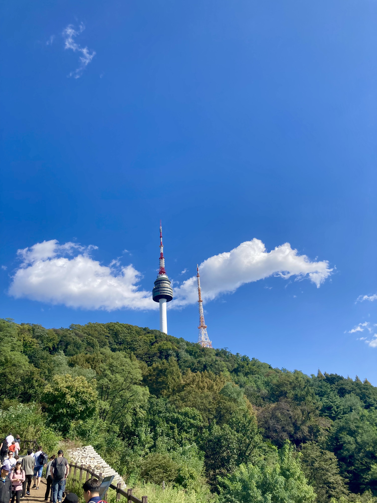

    <figure>
    
    </figure>
        <figure>
    
    </figure>

# 반영된 생각

This semester went by really quickly. It was interesting getting used to Berkeley Korean classes again after coming back from Korea, but overall I was happy that I could fit into the class despite only having been learning Korean for around 8 months at the time. At the start of the class it was a bit difficult getting my writing and speaking up to speed, but luckily I know a decent amount of vocab so that gave me a good place to start. With writing I typically (and still do) get confused with what ending to write in, since I tend to always default to the polite or informal ending because I use those the most. My reading and listening got a lot better this semester, and I'm now reading some middle-school level books in Korean. I'm also able to get the general subject and follow the flow of most Korean conversations now, and I think I just need to listen to more Korean media to improve further. Speaking is definitely my biggest struggle, in large part because I get embarrassed about saying something incorrect, particularly around fluent speakers. That makes it harder to practice (it doesn't help that LEP never matched me this semester >:( ). However, I will keep trying to improve so that next time I go see my friends in Korea I can impress them with my knowledge. Overall my Korean skills improved a lot since I started this semester, and I can now have conversations with friends entirely in Korean on KakaoTalk, which is really fun. I'm very thankful to everyone in the class for making this semester a fun experience and hope to stay in touch in the future!

